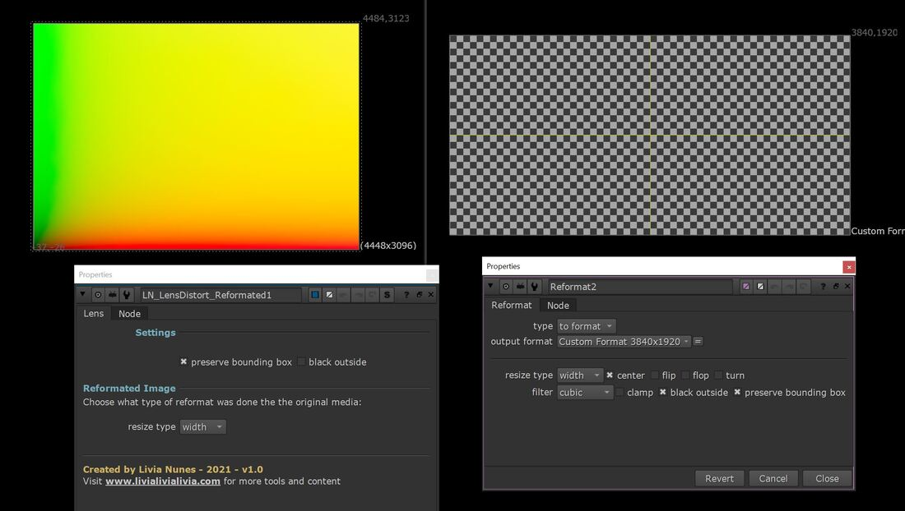

# LN_DistortReformatted

> Applies a lens-distortion ST-Map shot at the original camera format to a reformatted or cropped plate.

The problem this solves: you have an ST-Map of the lens distortion generated at the
**original camera format**, but the plate you're working on has been reformatted, resized
or cropped. Applied naively the map no longer lines up, and the distortion is wrong by
exactly the amount the format changed.

This rebuilds the geometry — it works out the relationship between the original format
and the one you're actually working in, and reformats the ST-Map to match before applying
it via `STMap`.

| Control | What it does |
|---|---|
| **resize type** | What kind of reformat was done to the original media. Only `width` and `height` types are supported. |
| **preserve bounding box** / **black outside** | Passed through to the internal `STMap`. |
| **original format** | The format the ST-Map was generated at. |

**Inputs:** `image` (the reformatted plate), `ST_Map` (the distortion map at original format).

---

**Category:** Lens & distortion  ·  **Version:** v1.0 (2021)

[← back to all tools](../README.md)
