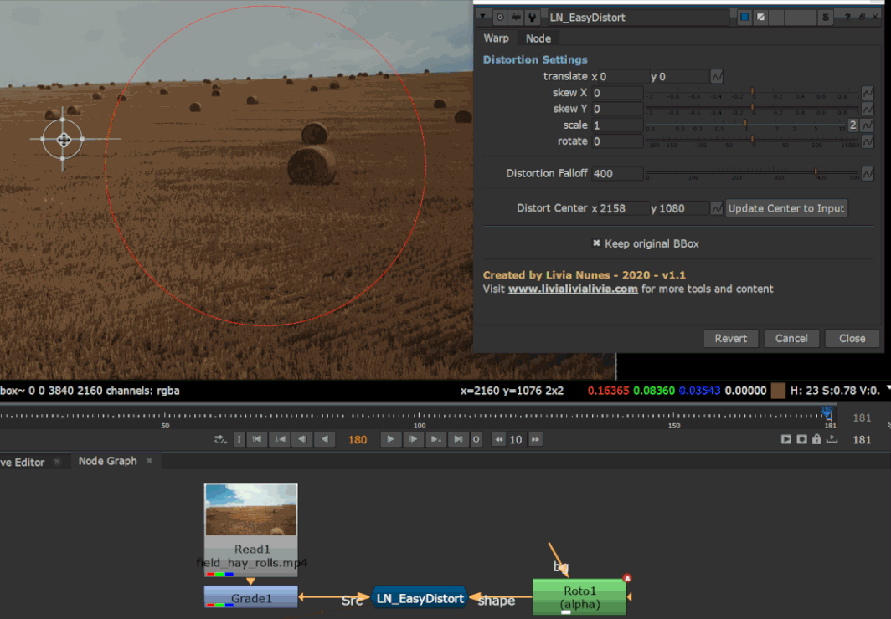

# LN_EasyDistort

> Lightweight local warping driven by ST-Maps, with a soft falloff you can shape.

A light way to push image content around locally without reaching for a full warp setup.
It generates an ST-Map from a transform and applies it through a falloff, so the
distortion fades out smoothly instead of stopping at a hard boundary.

| Control | What it does |
|---|---|
| **translate / scale / rotate / skew X / skew Y** | The transform that drives the distortion. |
| **Distortion Falloff** | How quickly the effect fades away from the centre. |
| **Distort Center** | Where the falloff is centred. |
| **Update Center to Input** | Snaps the centre to the middle of the connected image. |
| **Keep original BBox** | Stops the bounding box growing as content is pushed around. |

Feed a matte into the **shape** input to confine the distortion to a region.

Because it's ST-Map based it's cheap, and it concatenates far better than stacking warps.

---

**Category:** Lens & distortion  ·  **Version:** v1.1 (2020)

[← back to all tools](../README.md)
