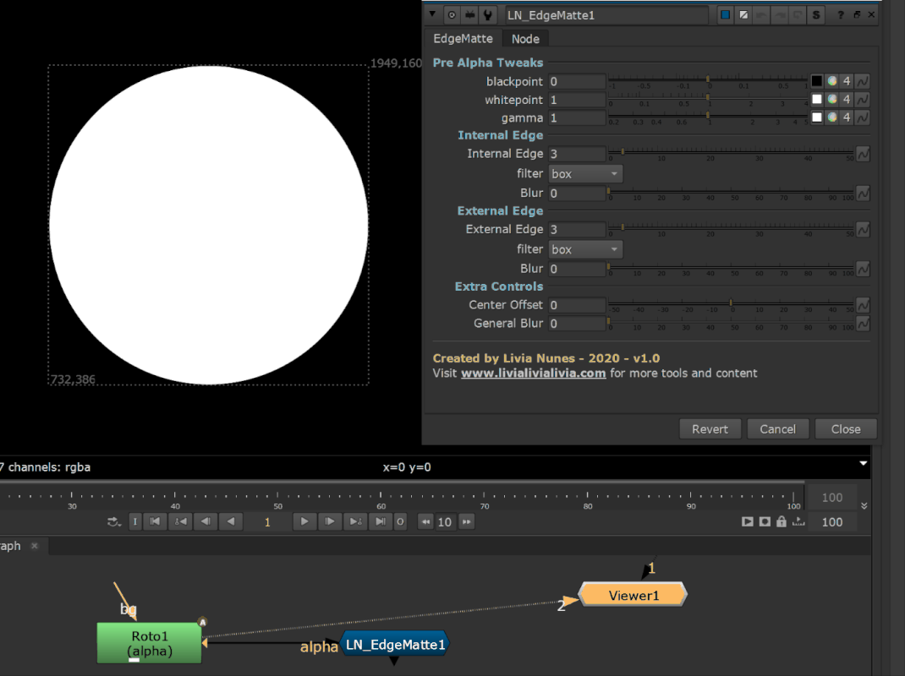

# LN_EdgeMatte

> Builds an edge matte from an alpha, with independent control of the inside and outside edge.

Give it an alpha and it returns a matte of just the **edge** — the transition band — which
is what you actually want to isolate when you're doing edge grades, edge blurs, light
wrap or targeted denoise.

The inside and outside halves of the edge are built separately so the band doesn't have
to be symmetrical:

| Control | What it does |
|---|---|
| **blackpoint / whitepoint / gamma** | Pre-shape the incoming alpha before the edge is derived. |
| **Internal Edge** + filter + blur | How far the matte reaches *inside* the alpha. |
| **External Edge** + filter + blur | How far it reaches *outside*. |
| **Center Offset** | Slides the whole band in or out without changing its width. |
| **General Blur** | Softens the finished edge matte. |

---

**Category:** Edges & mattes  ·  **Version:** v1.0 (2020)

[← back to all tools](../README.md)
