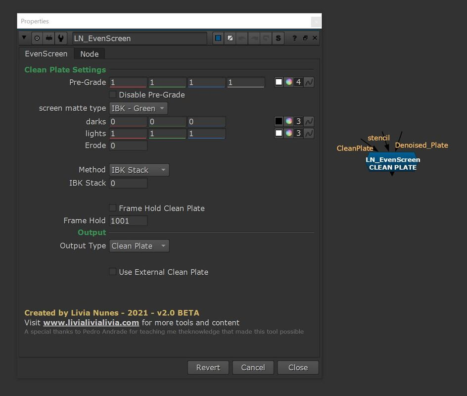

# LN_EvenScreen

> Builds a clean plate and an evened-out screen from a green/blue screen plate, so keys pull far more cleanly.

Uneven lighting across a green or blue screen is the single biggest reason a key fights
you. `LN_EvenScreen` attacks that in two stages: it derives a **clean plate** from the
footage itself, then uses that clean plate to **flatten the screen** to a single even
colour before you ever reach for a keyer.

### How it works

A pre-key (IBK green/blue, or your own matte) separates screen from subject. From that,
a stack of IBK Colour nodes builds a clean plate — the more colours in the stack, the
more faithfully it reconstructs uneven lighting, spill and lighting falloff. The clean
plate is then divided back out of the original to leave an even screen.

### Controls worth knowing

| Control | What it does |
|---|---|
| **screen matte type** | The pre-key that decides what is screen and what isn't. `IBK - Green` / `IBK - Blue` presets, or `Custom` to feed in a Keylight matte via the *stencil* input. |
| **Method** | `IBK Stack` for final quality; `Low_Quality` for fast feedback during shot assembly (often good enough on its own). |
| **IBK Stack** | How many IBK colours in the stack. Around **7** is a good default. |
| **Frame Hold Clean Plate** | Freeze the clean plate on one frame instead of solving per-frame. |
| **Output Type** | Switch between the `Clean Plate` and the `Even Screen`. |
| **Use External Clean Plate** | Ignore the generated plate and use your own on the *CleanPlate* input. |
| **Calculate Even Screen Colour** | Samples the current frame and sets the target flat colour. |
| **Shuffle Out Clean Plate** | Creates a `Shuffle` downstream that outputs the clean plate on its own channel. |

### Tips

- Set the **darks** and **lights** on the pre-key first — you want only shades of the
  screen colour and black, nothing else, before the stack does its work.
- Feed extra garbage or holdout mattes into the **stencil** input to keep the clean-plate
  solve away from areas it shouldn't see.
- This is the heaviest tool in the set. Work on `Low_Quality` while you're blocking out
  the comp and switch to `IBK Stack` when you're finalising.

---

**Category:** Keying & screens  ·  **Version:** v2.0 BETA (2021)

[← back to all tools](../README.md)
