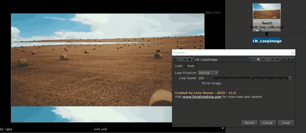

# LN_LoopImage

> Loops an image horizontally or vertically, seamlessly and forever.

Scrolls an image continuously in one direction and wraps it, so it tiles seamlessly with
no visible seam and no keyframes.

| Control | What it does |
|---|---|
| **Loop Direction** | `Horizontal` or `Vertical`. |
| **Loop Speed** | How fast it travels. |
| **Mirror Image** | Mirrors the tile so the join matches even when the source doesn't wrap cleanly. |

Good for conveyor belts, running water, scrolling signage, star fields, and backgrounds
that need to move forever without anyone spotting the repeat.

---

**Category:** Workflow & QC  ·  **Version:** v1.0 (2020)

[← back to all tools](../README.md)
