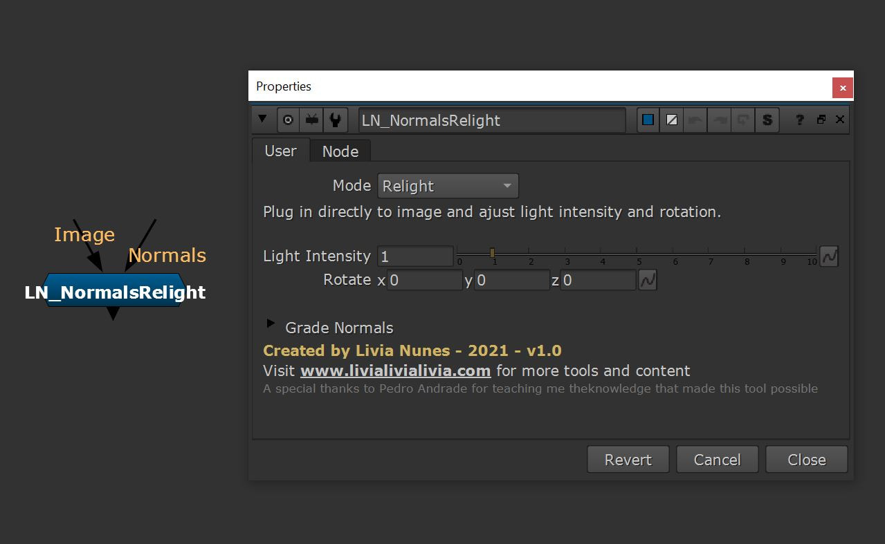

# LN_NormalsRelight

> Relight an image from a normals AOV, or just rotate the normals into another orientation.

Sometimes you get a normals pass and no P pass, and you still need to add light. This
takes the normals AOV and lets you relight from it with full control over light
direction — no position pass required.

It has two modes:

- **Rotate Normals** — the node outputs the rotated normals themselves. Useful when you
  need the normals in a different orientation for something else entirely.
- **Relight** — plug the image in as well, then adjust light intensity and rotation.

| Control | What it does |
|---|---|
| **Rotate** | Light direction, driven through an internal `Axis`. |
| **Light Intensity** | Strength of the relight. |
| **Grade Normals** tab | Full grade on the normals before they're used — blackpoint, whitepoint, lift, gain, multiply, gamma, offset. |

**Inputs:** `Normals`, `Image`.

*Thanks to Pedro Andrade for teaching me the knowledge that made this tool possible.*

---

**Category:** CG & deep  ·  **Version:** v1.0 (2021)

[← back to all tools](../README.md)
