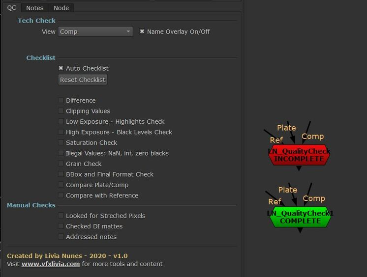

# LN_QualityCheck

> A full QC pass in one node: eleven checking views plus a checklist that fills itself in.

QC is boring, repetitive, and the thing you skip when you're behind — which is exactly
when you need it. This packages the whole pass into one node.

### The views

The **View** dropdown cycles through eleven ways of looking at the shot:

| View | Looking for |
|---|---|
| `Comp` | The shot as delivered. |
| `Difference` | What actually changed versus the plate. |
| `Clipping` | Values pushed past legal range. |
| `Low Exposure` | Highlight detail — gained up to check the top end. |
| `High Exposure` | Black levels — gained up to check the bottom end. |
| `Saturation` | Over-saturated regions. |
| `NaN-inf-zero blacks` | Illegal values. |
| `Grain` | Grain match against the plate. |
| `BBox` | Bounding box and final format. |
| `Compare Plate-Comp` | Wipe against the plate. |
| `Compare Reference` | Wipe against a reference. |

### Illegal values

Dedicated toggles for **Show Zero Blacks**, **Show NaN**, **Show Inf** and **Show Negative
Values**. **Expand** erodes the result so a single illegal pixel is actually visible
instead of being one dot you'll never spot.

### Wipe

**Wipe Comp/Plate** with **Invert Wipe** and **Vertical Wipe**, plus an **ALTERNATE**
button that snaps between the two inputs — much faster than dragging when you're
comparing detail.

### The checklist

The point of the node. **Auto Checklist** ticks each item off as you scroll through the
corresponding view, so the list fills itself in as you work. The node label turns from
**RED** to **GREEN** when everything is ticked, so an unfinished QC is visible in the node
graph at a glance.

There are manual entries too, for the things no node can check for you: *Looked for
Stretched Pixels*, *Checked DI mattes*, *Addressed notes*. **Reset Checklist** clears
everything for the next version.

A **Notes** tab holds per-shot notes inside the node.

**Inputs:** `Comp`, `Plate`, `Ref`.

---

**Category:** Workflow & QC  ·  **Version:** v1.0 (2020)

[← back to all tools](../README.md)
