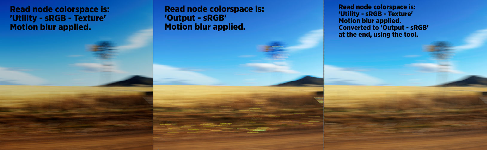

# Original_sRGB

> Makes sRGB elements look the way they do outside ACES — for logos, textures and graphics.

Drop a logo or a graphic into an ACES comp and the colours shift. This converts sRGB
colours so they display the way you'd expect **outside** the ACES pipeline, which is
usually what a client means when they say the brand colour is wrong.

There's an **INVERT** mode too (`Output sRGB` → `Utility Texture sRGB`) for going the
other way.

> ⚠️ **Read this before using it.** From the tool itself:
>
> *"This operation breaks linearization and must be done with care, only at the end of the
> comp pipe and only in situations where you absolutely need to keep the original image
> colors."*

So: end of the pipe, on graphics that must match a brand reference, and not as a general
colour fix.

---

**Category:** Colour  ·  **Version:** v1.0 (2021)

[← back to all tools](../README.md)
